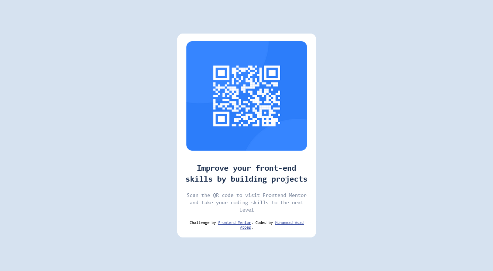

### Screenshot

### Links

- Solution URL: [Add solution URL here](https://your-solution-url.com)
- Live Site URL: [Add live site URL here](https://your-live-site-url.com)

## My process

### Built with

- Semantic HTML5 markup
- CSS custom properties
- Flexbox
- CSS Grid
- Mobile-first workflow

### Continued development
"
In any project I am struggling on layout design that how can I structured  my HTML how much  div that I use to develop nested layout. My keen focus on the layout designing of the website in future projects.

### Useful resources

- [Example resource 1](https://www.CSS tricks/almanac.com) - This helped me for XYZ reason. I really liked this pattern and will use it going forward.

